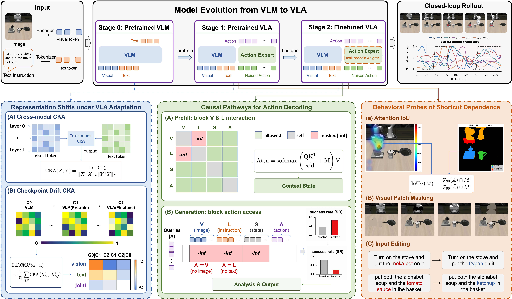

# 🔍 VLA-Trace: Diagnosing Vision-Language-Action Models through Representation and Behavior Tracing

## 🧭 Overview

> This repository hosts the public alpha implementation of **VLA-Trace**, a diagnostic framework for understanding how Vision-Language-Action models convert multimodal knowledge into embodied control.

**VLA-Trace** studies VLA models as evolving, controllable systems rather than opaque end-to-end policies. It builds a progressive evidence chain from **representation dynamics**, to **causal control attribution**, to **closed-loop behavioral manifestation**.

<p align="center">
  
</p>

Modern VLA models inherit powerful vision-language priors, but policy learning can reshape those priors in subtle ways. VLA-Trace asks where multimodal knowledge is preserved, which pathways are actually used for action decoding, and when visually grounded behavior still fails to follow fine-grained semantic changes.

## 🗞️ News

- **[2026-06-03]** 💻 Stage 1 representation tracing, Stage 2 attention-knockout tooling, Stage 3 offline behavior probes, artifact-driven visualization commands, configs, docs, and smoke tests are available.
- **[2026-06-04]** 📄 arXiv citation added: [arXiv:2605.30117](https://arxiv.org/abs/2605.30117).
- **[Coming Soon]** 🌐 Project page, visualizations, and result artifacts will be released.

## ✨ Highlights

- 🧬 **Representation-level diagnosis:** trace how visual, textual, and joint representations evolve from pretrained VLMs to pretrained and finetuned VLAs.
- 🔌 **Causal control attribution:** use attention knockout to test which modality routes are necessary for action decoding.
- 🧪 **Behavior-level validation:** connect internal pathways to rollout attention, visual shortcut dependence, and semantic editing behavior.
- 📊 **Architecture-aware findings:** compare pi-style and OpenVLA-style policies to reveal different adaptation and routing patterns.
- 🛠️ **Release-oriented toolkit:** the current alpha includes saved-bank CKA, knockout-mask tooling, Stage 3 behavior probes, and plotting commands for CKA reports, knockout evaluation JSONs, and attention summaries.

## 🧩 Diagnostic Pipeline

| Stage                            | Core Question                                | Main Probe                                  | What It Reveals                                                        |
| -------------------------------- | -------------------------------------------- | ------------------------------------------- | ---------------------------------------------------------------------- |
| 🧬**Representation Trace** | What changes during VLA adaptation?          | Cross-modal CKA + checkpoint-drift CKA      | Preservation or reorganization of visual, textual, and joint subspaces |
| 🔌**Causal Pathway Trace** | Which modalities control action decoding?    | Prefill and generation attention knockout   | Causal visual/text/action routes and layer-wise bottlenecks            |
| 🧪**Behavior Trace**       | How do internal pathways appear in rollouts? | Attention IoU, patch masking, input editing | Grounding, shortcut dependence, and semantic controllability           |

## 🔬 Method

### 🧬 Stage 1: Representation Shifts under VLA Adaptation

We compare internal representations across three model stages:

| Symbol | Stage          | Description                                          |
| ------ | -------------- | ---------------------------------------------------- |
| `C0` | Pretrained VLM | General vision-language prior before action learning |
| `C1` | Pretrained VLA | VLA policy after action-oriented pretraining         |
| `C2` | Finetuned VLA  | Task-finetuned policy with task-specific weights     |

VLA-Trace uses:

- **Cross-modal CKA** to measure layer-wise image-text alignment.
- **Checkpoint-drift CKA** to measure whether vision, text, and joint subspaces are preserved or reorganized across `C0`, `C1`, and `C2`.

### 🔌 Stage 2: Causal Pathways for Action Decoding

To test whether multimodal information is merely represented or actually used, VLA-Trace performs attention knockout interventions:

- **Prefill knockout** blocks vision-language interaction during context formation.
- **Generation knockout** blocks action-token access to image or instruction tokens during decoding.
- **Layer-wise knockout** localizes whether action-critical information flows through narrow bottlenecks or distributed regions.

This turns representation analysis into a causal question: *which pathway must remain open for the robot to act successfully?*

### 🧪 Stage 3: Behavioral Probes of Grounding and Shortcut Dependence

In the full manuscript pipeline, VLA-Trace then moves from internal mechanisms to
closed-loop behavior. The public alpha provides offline artifact schemas,
metrics, masking utilities, edit manifests, and visualization commands for
these probes; turnkey online rollout collectors remain adapter-backed:

- **Attention IoU:** checks whether action attention overlaps with objects, robot regions, and robot-object interaction regions.
- **Temporal attention analysis:** tests whether attention shifts with multi-step task progress.
- **Visual patch masking:** removes target objects, grippers, robot bodies, or backgrounds to expose shortcut reliance.
- **Input editing:** changes objects or instructions to test fine-grained semantic controllability.

## 📊 Key Findings

The manuscript reports the following findings; the current public alpha exposes the
analysis cores and artifact schemas needed to apply the same methods to your
own checkpoints, exported representation banks, rollout traces, and evaluation
logs. It does not bundle private checkpoints, datasets, or result
logs.

- 🧬 **Different VLAs adapt different modalities.** pi0.5 shows more fluctuating cross-modal fusion and reorganizes textual representations into task-conditioned control features, while OpenVLA more strongly preserves text-pooled representations and mainly restructures visual/joint subspaces.
- 🔌 **Action decoding follows architecture-specific routes.** pi0.5 is dominated by a concentrated visual-to-action pathway, whereas OpenVLA relies on both visual grounding and prompt-region access.
- 🧪 **Visual grounding does not guarantee semantic flexibility.** Models often track task-relevant objects and robot-object interaction regions, yet may remain biased toward the original visual-task configuration after semantic edits.
- 📉 **Shortcut dependence is model-specific.** Target-object masking is highly destructive across models, while gripper, robot-body, and background masking reveal different reliance patterns across architectures.

## 🤖 Models and Benchmarks

The full diagnostic chain focuses on **pi0.5** and **OpenVLA**, with supplementary experiments on **OpenVLA-OFT** and **X-VLA**.

| Model       | Backbone   | Decoding       | Observation                     | Coverage                             |
| ----------- | ---------- | -------------- | ------------------------------- | ------------------------------------ |
| pi0.5       | PaliGemma  | Flow matching  | RGB + language                  | LIBERO, CALVIN                       |
| OpenVLA     | Prismatic  | Autoregressive | RGB + language                  | LIBERO, CALVIN, Simpler              |
| OpenVLA-OFT | Prismatic  | L1 regression  | RGB + language + proprioception | LIBERO, CALVIN, RoboTwin2.0          |
| X-VLA       | Florence-2 | Flow matching  | RGB + language + soft prompt    | LIBERO, CALVIN, Simpler, RoboTwin2.0 |

Benchmarks include:

- **LIBERO-10:** long-horizon compositional manipulation.
- **LIBERO-Object:** object-centric understanding.
- **LIBERO-Spatial:** spatial reasoning.
- **LIBERO-Goal:** goal-conditioned control.
- **CALVIN, SimplerEnv-BridgeV2, and RoboTwin2.0:** broader validation across sequential control, real-to-sim transfer, and bimanual manipulation settings.

## 🛠️ Repository Status

Stage 1, Stage 2, LIBERO rollout entrypoints, and offline Stage 3 behavior
tracing are available as a lightweight public alpha. Heavy model execution
remains adapter-backed: users provide checkpoint paths, optional model
dependencies, benchmark installation paths, and model-specific hooks locally.

### Available Now

- [x] 🧬 LIBERO manifest export, hidden-state-to-bank collection, saved-bank conversion, cross-modal CKA, and checkpoint-drift CKA
- [x] 🧬 Matched-layer checkpoint-drift summaries for `vision_pooled`, `text_pooled`, and `joint_pooled`
- [x] 📐 Token pooling helpers for `vision_pooled`, `text_pooled`, and `joint_pooled`
- [x] 🔌 Public Stage 2 knockout specs, additive mask builders, text-scope selection, directional settings, prefill/generation combined settings, all-layer settings, and standard layer/window sweep manifests
- [x] 🎮 `eval-libero` rollout CLI for OpenVLA/pi0.5 LIBERO inference, dry-run planning, mock smoke tests, custom policy adapters, VLM4VLA-compatible adapters, and knockout-manifest execution
- [x] 📊 Visualization commands for CKA, knockout success curves, attention IoU summaries, generic attention maps, and overlays
- [x] 🧪 Stage 3 attention localization metrics, attention overlay, LIBERO-style PatchMask runtime observation editing, offline PatchMask data generation, and input-edit manifests
- [x] 🩺 `doctor` checks for local configs, custom model/data paths, representation banks, attention/mask artifacts, result JSONs, and input-edit manifests
- [x] ⚙️ Model configs for pi0.5 and OpenVLA
- [x] ⚙️ LIBERO benchmark configs for `libero_10`, `libero_goal`, `libero_object`, and `libero_spatial`
- [x] 🧪 Offline unit and CLI smoke tests

### Adapter Boundaries

The open-source repository is a method/toolchain release. It provides the
schemas, CLI tools, mask builders, metrics, and plotting code needed to run the
manuscript analyses on your own traces. The `eval-libero` command provides the
rollout loop and result schema; heavy model forwarding and model-internal
attention-hook placement remain adapter responsibilities because each VLA
codebase exposes those tensors differently.

Community users can plug in custom models by exporting the documented
representation banks, attention arrays, mask arrays, rollout success logs, and
input-edit result logs, or by passing `--adapter-factory` to `eval-libero`. The
core analysis and visualization code does not depend on private checkpoints or
result directories.

## 🗂️ Repository Structure

```text
VLA-Trace/
├── configs/                 # Model, benchmark, and probe configs
├── docs/                    # User documentation
├── vla_trace/
│   ├── adapters/            # Model metadata and adapter contracts
│   ├── evaluation/          # LIBERO rollout runner and policy adapter bridge
│   ├── representations/     # Cross-modal and checkpoint-drift CKA
│   ├── knockout/            # Attention knockout interventions
│   ├── behavior/            # Stage 3 behavior metrics, masks, and edits
│   ├── visualization/       # Artifact-driven plotting commands
│   └── io/                  # Config and artifact helpers
├── tests/                   # Offline unit and smoke tests
├── pyproject.toml
└── README.md
```

## 🚀 Quick Start

```bash
python -m pip install -e ".[test,plot]"
vla-trace --help
pytest -q
```

For real LIBERO rollout execution, install the extras that match your adapter:

```bash
python -m pip install -e ".[libero,openvla]"  # OpenVLA-style policies
python -m pip install -e ".[libero,pi05]"     # pi0.5/OpenPI-style policies
```

Supported command-line shortcuts:

- Models: `OpenVLA`, `pi0.5`
- LIBERO datasets: `libero_10`, `libero_goal`, `libero_object`, `libero_spatial`

Path policy:

- Repository configs use relative paths or `null` placeholders.
- Do not commit local machine paths, checkpoint roots, dataset roots, or cluster
  scripts.
- Users pass their own paths at runtime with `--model-path`, `--data-root`,
  `--model-config`, and `--benchmark-config`.

What "adapter" and "online evaluator" mean in this toolkit:

- **OpenVLA/pi0.5 representation extraction adapter** means a small
  model-specific bridge that runs your local model forward and exports hidden
  states into the VLA-Trace representation-bank schema. The public CKA core does
  not require the original manuscript checkpoints; it only requires saved banks.
- **LIBERO online knockout evaluator** means a rollout-side bridge that loads a
  VLA-Trace knockout mask artifact, applies it inside your model's attention
  implementation during LIBERO evaluation, and writes success-rate JSON logs.
  The public repository provides the mask builder, expected result schema, and
  plotting code; users can plug those artifacts into their own LIBERO runner.

In other words, this repository is for applying the analysis method to your own
model/data artifacts. It is not a packaged copy of the manuscript's private
checkpoints, rollout logs, or exact manuscript figure build.

Check a local setup:

```bash
vla-trace doctor \
  --model OpenVLA \
  --dataset libero_10 \
  --model-path checkpoints/openvla \
  --data-root datasets/LIBERO \
  --bank C1=artifacts/openvla/c1_bank.json \
  --attention artifacts/attention/attention_maps.npz \
  --masks artifacts/attention/step_masks.npz \
  --results runs/openvla_libero_10_knockout/eval_results \
  --input-edits runs/stage3/input_edits.jsonl \
  --output runs/doctor_openvla_libero10.json
```

`doctor` reports `ok`, `warning`, or `error` checks. Use `--strict` if you want
the command to return nonzero when any check fails.

Run LIBERO inference/evaluation:

```bash
# Check the exact rollout jobs without importing LIBERO or loading a model.
vla-trace eval-libero \
  --model OpenVLA \
  --dataset libero_10 \
  --model-path checkpoints/openvla \
  --data-root datasets/LIBERO \
  --task-ids 0,1 \
  --num-trials-per-task 2 \
  --dry-run \
  --print-plan

# Real OpenVLA/pi0.5 rollout through a user adapter.
vla-trace eval-libero \
  --model OpenVLA \
  --dataset libero_goal \
  --model-path checkpoints/my_openvla \
  --data-root datasets/LIBERO \
  --adapter-factory my_policy.adapters:create_policy \
  --task-ids 0 \
  --num-trials-per-task 5 \
  --output-dir runs/openvla_libero_goal_eval

# Compatibility path for an existing VLM4VLA checkout.
vla-trace eval-libero \
  --model pi0.5 \
  --dataset libero_10 \
  --model-path checkpoints/pi05 \
  --data-root datasets/LIBERO \
  --vlm4vla-root ../VLM4VLA \
  --config-path local/configs/pi05_libero.yaml \
  --openpi-root ../openpi \
  --tokenizer-path assets/tokenizer.model \
  --openpi-config-name pi05_libero \
  --task-ids 0 \
  --num-trials-per-task 5 \
  --output-dir runs/pi05_libero10_eval
```

`--adapter-factory` receives a `PolicyBuildRequest` and returns a policy with
one of these methods: `predict_action(step)`, `step(image, task)`, or
`step_pi0(image, wrist_image, state, task)`. For knockout experiments the policy
should either consume `request.knockout_config` during construction or implement
`configure_knockout(config)`.

Using your own model:

- If your model follows the OpenVLA layout, call the tools with
  `--model OpenVLA --model-path path/to/your/checkpoint`.
- If your model follows the pi0.5 layout, call the tools with
  `--model pi0.5 --model-path path/to/your/checkpoint`.
- If you keep model metadata in your own YAML/JSON file, pass it with
  `--model-config path/to/model.yaml`.
- For Stage 1 CKA, the public core only needs saved representation banks, so a
  custom model can be analyzed as long as you export banks in the documented
  schema.
- For Stage 2 knockout, the public core builds a validated sweep/mask artifact.
  Running the intervention inside a custom model requires an adapter that maps
  the artifact to that model's attention implementation.
- For visualization, the plotting commands consume JSON/CSV artifacts. They do
  not assume the original manuscript's result directories.

Example with a user-provided OpenVLA-style checkpoint:

```bash
vla-trace cka --model OpenVLA --dataset libero_10 \
  --model-path checkpoints/my_openvla \
  --data-root datasets/LIBERO \
  --bank C0=artifacts/my_openvla/c0_bank.json \
  --bank C1=artifacts/my_openvla/c1_bank.json \
  --output-dir runs/my_openvla_libero_10_cka

vla-trace knockout --model OpenVLA --dataset libero_10 \
  --model-path checkpoints/my_openvla \
  --data-root datasets/LIBERO \
  --phase generation \
  --mode no_image \
  --layers 0,8,16,24,31 \
  --output runs/my_openvla_libero_10_knockout/mask.json
```

Inspect a model config:

```bash
vla-trace inspect-model configs/models/openvla.yaml
vla-trace inspect-model configs/models/pi05.yaml
```

Run Stage 1 CKA by choosing a model and dataset from the command line:

```bash
vla-trace cka --model OpenVLA --dataset libero_goal --print-config

vla-trace cka --model pi0.5 --dataset libero_object \
  --analysis checkpoint_drift \
  --view joint_pooled \
  --model-path checkpoints/pi05 \
  --data-root datasets/LIBERO \
  --bank C0=artifacts/pi05/c0_bank.json \
  --bank C1=artifacts/pi05/c1_bank.json \
  --bank C2=artifacts/pi05/c2_bank.json \
  --output-dir runs/pi05_libero_object_drift
```

Run Stage 2 knockout by choosing the model, dataset, phase, mode, and layers:

```bash
vla-trace knockout --model OpenVLA --dataset libero_spatial \
  --model-path checkpoints/openvla \
  --data-root datasets/LIBERO \
  --phase generation \
  --mode no_image \
  --center-layers 0,8,16,24,31 \
  --window-size 7 \
  --output runs/openvla_libero_spatial_knockout/mask.json

vla-trace knockout --model pi0.5 --dataset libero_10 \
  --phase both \
  --mode no_image+no_text \
  --layers 0,4,8,12,17 \
  --output runs/pi05_libero_10_knockout/mask.json
```

For Stage 1, the complete public chain is `export-libero-manifest` or a custom
manifest, then `collect-repr` to build representation banks, then `cka` to run
cross-modal or checkpoint-drift analysis. For Stage 2, `vla-trace knockout`
writes validated single-setting mask artifacts and `vla-trace knockout-sweep`
writes the standard layerwise/all-layer job matrix. Online model forwarding
and LIBERO rollout execution remain adapter-backed.

### Stage 1 CKA Details

Print a resolved config without running analysis:

```bash
vla-trace cka --model OpenVLA --dataset libero_goal --print-config
vla-trace cka --model pi0.5 --dataset libero_object --print-config
```

The Stage 1 workflow is:

```text
LIBERO/custom samples -> manifest.jsonl -> hidden states for each checkpoint stage -> representation banks -> CKA report -> CKA figures
```

`C0`, `C1`, and `C2` are checkpoint-stage labels supplied by the user. They are
not bundled in this repository and are not inferred from LIBERO:

| Stage | Meaning in the VLA-Trace method | User-provided artifact |
| --- | --- | --- |
| `C0` | pretrained VLM or action-free base model | hidden states from that checkpoint |
| `C1` | action-pretrained VLA checkpoint | hidden states from that checkpoint |
| `C2` | LIBERO/task-finetuned VLA checkpoint | hidden states from that checkpoint |

If you only have one checkpoint, collect one bank and run a single-checkpoint
cross-modal profile. Checkpoint-drift CKA requires at least two comparable
banks, and the three-stage `C0 -> C1 -> C2` analysis requires all three.

Export a LIBERO RLDS manifest when your local environment has a compatible
LIBERO dataset loader:

```bash
vla-trace export-libero-manifest \
  --data-root datasets/LIBERO \
  --data-mix libero_10_no_noops \
  --output-dir artifacts/libero_10_cka_samples \
  --max-samples 200 \
  --per-task-quota 20
```

The manifest schema is JSONL:

```json
{"sample_id":"libero_10__000000","task_name":"libero_10","instruction":"put the moka pot on the stove","image_path":"artifacts/libero_10_cka_samples/images/000000.png"}
```

For custom models or datasets, write the same manifest yourself. To collect a
bank, each row can either contain `hidden_states_path`, or you can pass
`--hidden-state-dir` where files are named `<sample_id>.npz/.npy/.json`, or you
can pass an adapter factory with `--adapter package.module:create_adapter`.
The hidden-state artifact must expose layers as `hidden_states=[layers,tokens,dim]`
or keys such as `layer_0`, `layer_1`.

Plan the full OpenVLA/LIBERO-10 stage collection before running model code:

```bash
vla-trace collect-repr-stages \
  --model OpenVLA \
  --dataset libero_10 \
  --manifest artifacts/libero_10_cka_samples/manifest.jsonl \
  --stage C0=checkpoints/openvla_base \
  --stage C1=checkpoints/openvla_pretrained_vla \
  --stage C2=checkpoints/openvla_libero10_finetuned \
  --hidden-state-root artifacts/openvla/libero_10 \
  --bank-root artifacts/openvla/libero_10_banks \
  --token-group vision_pooled=1:257 \
  --token-group text_pooled=257:289 \
  --token-group joint_pooled=1:289 \
  --dry-run \
  --output runs/openvla_libero10_stage_plan.json
```

The plan reports one job per stage, the expected hidden-state directory
(`C0_hidden_states`, `C1_hidden_states`, `C2_hidden_states` under
`--hidden-state-root`), the bank output path, and the exact `collect-repr`
command for each stage. `configured=true` means the required fields are present;
`path_warnings` tells you which local paths still need to be created or
provided before real collection.

After your adapter or local model script has exported the hidden-state files,
collect all three banks in one command:

```bash
vla-trace collect-repr-stages \
  --model OpenVLA \
  --dataset libero_10 \
  --manifest artifacts/libero_10_cka_samples/manifest.jsonl \
  --hidden-state-root artifacts/openvla/libero_10 \
  --bank-root artifacts/openvla/libero_10_banks \
  --token-group vision_pooled=1:257 \
  --token-group text_pooled=257:289 \
  --token-group joint_pooled=1:289 \
  --output runs/openvla_libero10_stage_collect.json
```

Or let VLA-Trace call your extractor adapter for each stage:

```bash
vla-trace collect-repr-stages \
  --model OpenVLA \
  --dataset libero_10 \
  --manifest artifacts/libero_10_cka_samples/manifest.jsonl \
  --adapter my_openvla_adapter:create_adapter \
  --stage C0=checkpoints/openvla_base \
  --stage C1=checkpoints/openvla_pretrained_vla \
  --stage C2=checkpoints/openvla_libero10_finetuned \
  --bank-root artifacts/openvla/libero_10_banks \
  --token-group vision_pooled=1:257 \
  --token-group text_pooled=257:289 \
  --token-group joint_pooled=1:289
```

The adapter template at `examples/adapters/openvla_representation_adapter.py`
shows the required `create_adapter(...)->adapter` and
`extract_hidden_states(row)` interface for OpenVLA/OpenVLA-OFT users.

Collect a representation bank from exported hidden states:

```bash
vla-trace collect-repr \
  --model OpenVLA \
  --dataset libero_10 \
  --manifest artifacts/libero_10_cka_samples/manifest.jsonl \
  --hidden-state-dir artifacts/openvla/C1_hidden_states \
  --bank-output artifacts/openvla/C1_bank.npz \
  --token-group vision_pooled=1:257 \
  --token-group text_pooled=257:289 \
  --token-group joint_pooled=1:289 \
  --checkpoint-name C1 \
  --model-path checkpoints/openvla \
  --data-root datasets/LIBERO \
  --output runs/openvla_C1_collect_report.json
```

Use an adapter when you want VLA-Trace to call your local model directly:

```bash
vla-trace collect-repr configs/experiments/openvla_libero_repr.yaml \
  --manifest artifacts/libero_10_cka_samples/manifest.jsonl \
  --adapter my_openvla_adapter:create_adapter \
  --bank-output artifacts/openvla/C1_bank.npz \
  --model-path checkpoints/openvla \
  --data-root datasets/LIBERO
```

The adapter object should implement `extract_hidden_states(row)` and return a
mapping from layer index to `[tokens, hidden_dim]` arrays. Optional `load()` is
called once before collection.

For OpenVLA-OFT, use the same OpenVLA-style Stage 1 flow with a custom adapter
that loads the OFT checkpoint and exports the same layer-token hidden-state
schema:

```bash
vla-trace collect-repr-stages \
  --model OpenVLA \
  --dataset libero_10 \
  --manifest artifacts/libero_10_cka_samples/manifest.jsonl \
  --adapter my_oft_adapter:create_adapter \
  --stage C0=checkpoints/openvla_base \
  --stage C1=checkpoints/openvla_pretrained_vla \
  --stage C2=checkpoints/openvla_oft_libero10 \
  --bank-root artifacts/openvla_oft/libero_10_banks \
  --token-group vision_pooled=1:257 \
  --token-group text_pooled=257:289 \
  --token-group joint_pooled=1:289
```

Use `model=OpenVLA` for collection because OFT follows an OpenVLA-style token
layout. Use explicit `--token-group` spans if your OFT implementation changes
prompt, proprioception, or action-token packing.

If you already have legacy research banks, convert them to the public schema:

```bash
vla-trace convert-bank \
  --input artifacts/legacy/pi05_libero_C1.pt \
  --output artifacts/pi05/C1_bank.npz \
  --metadata checkpoint=C1
```

Representation banks can be JSON or NPZ. A minimal JSON bank looks like:

```json
{
  "metadata": {
    "model": "OpenVLA",
    "dataset": "libero_10",
    "checkpoint": "C1"
  },
  "arrays": {
    "vision_pooled": [[0.1, 0.2], [0.3, 0.4]],
    "text_pooled": [[0.2, 0.1], [0.4, 0.3]],
    "joint_pooled": [[0.1, 0.3], [0.3, 0.5]]
  }
}
```

For layer-wise CKA, use keys such as `vision_pooled/layer_0`,
`text_pooled/layer_0`, and `joint_pooled/layer_0`. The legacy nested
`representations` layout is also accepted by the loader.

Run cross-modal CKA with saved banks:

```bash
vla-trace cka --model OpenVLA --dataset libero_10 \
  --analysis cross_modal \
  --layerwise \
  --model-path checkpoints/openvla \
  --data-root datasets/LIBERO \
  --bank C0=artifacts/openvla/c0_bank.json \
  --bank C1=artifacts/openvla/c1_bank.json \
  --bank C2=artifacts/openvla/c2_bank.json \
  --output-dir runs/openvla_libero_10_cka
```

Run checkpoint-drift CKA:

```bash
vla-trace cka --model pi0.5 --dataset libero_spatial \
  --analysis checkpoint_drift \
  --view joint_pooled \
  --reference C0 \
  --model-path checkpoints/pi05 \
  --data-root datasets/LIBERO \
  --bank C0=artifacts/pi05/c0_bank.json \
  --bank C1=artifacts/pi05/c1_bank.json \
  --bank C2=artifacts/pi05/c2_bank.json \
  --output-dir runs/pi05_libero_spatial_drift
```

Run publication-style matched-layer checkpoint-drift summaries:

```bash
vla-trace cka --model OpenVLA --dataset libero_10 \
  --analysis checkpoint_drift \
  --layerwise \
  --view joint_pooled \
  --reference C0 \
  --summary-views vision_pooled,text_pooled,joint_pooled \
  --bank C0=artifacts/openvla/c0_layerwise_bank.json \
  --bank C1=artifacts/openvla/c1_layerwise_bank.json \
  --bank C2=artifacts/openvla/c2_layerwise_bank.json \
  --output-dir runs/openvla_libero_10_layerwise_drift
```

Layer-wise drift banks should use keys such as `vision_pooled/layer_0`,
`text_pooled/layer_0`, and `joint_pooled/layer_0`. The report writes
`matched_layer_summary`, where each checkpoint/view includes `mean_cka`,
`mean_drift`, `n_layers`, `layers`, and `per_layer`.

Existing YAML configs are still supported:

```bash
vla-trace cka configs/experiments/openvla_libero_cka.yaml
vla-trace cka configs/experiments/pi05_libero_cka.yaml
```

Override a YAML config with user paths:

```bash
vla-trace cka configs/experiments/openvla_libero_cka.yaml \
  --model-config local/configs/openvla.yaml \
  --benchmark-config local/configs/libero_10.yaml \
  --model-path checkpoints/openvla \
  --data-root datasets/LIBERO
```

### Stage 2 Knockout Details

`knockout` means masking selected attention routes during model execution to
measure whether a modality path is causally needed for successful actions.
`knockout-sweep` is not the rollout itself. It writes a portable JSON manifest
containing many knockout jobs, for example every layer-window setting plus
all-layer baselines. The usual workflow is:

```text
choose setting -> build/inspect knockout spec -> run LIBERO rollouts with that spec -> plot success curves
```

Command roles:

| Command | Role | Output |
| --- | --- | --- |
| `vla-trace knockout` | Build one blocking spec/mask for one setting | `mask.json` |
| `vla-trace knockout-sweep` | Build many layer-wise/all-layer jobs | `sweep.json` |
| `vla-trace eval-libero` | Run LIBERO with a single setting or sweep job | success-rate result JSONs |
| `vla-trace plot-knockout-line` | Draw layer-wise vulnerability curves | PNG/PDF/SVG figures |

Print a resolved knockout config:

```bash
vla-trace knockout --model OpenVLA --dataset libero_goal --print-config
vla-trace knockout --model pi0.5 --dataset libero_object --print-config
```

Run OpenVLA knockout from command-line settings:

```bash
vla-trace knockout --model OpenVLA --dataset libero_goal \
  --model-path checkpoints/openvla \
  --data-root datasets/LIBERO \
  --phase generation \
  --mode no_image \
  --center-layers 0,8,16,24,31 \
  --window-size 7 \
  --output runs/openvla_libero_goal_knockout/mask.json
```

Run pi0.5 knockout from command-line settings:

```bash
vla-trace knockout --model pi0.5 --dataset libero_10 \
  --model-path checkpoints/pi05 \
  --data-root datasets/LIBERO \
  --phase both \
  --mode no_image+no_text \
  --layers 0,4,8,12,17 \
  --output runs/pi05_libero_10_knockout/mask.json
```

Knockout settings can be selected by CLI flags or YAML fields:

```bash
--phase prefill|generation|both
--mode baseline|no_image|no_text|no_vl|no_fusion
--direction 'image->action'|'text->action'|'image->text'|'text->image'|'image<->text'
--prefill-mode no_vl --generation-mode no_text
--text-scope all|instruction|semantic_instruction|full|bos_newline|newline_only|exclude_newline
--layers all
--layers 0,4,8,12
--center-layers 0,8,16,24,31
--window-size 7
--visual-tokens 256
--text-tokens 32
--action-tokens 7
```

Modes can be combined with `+`, for example `no_image+no_text`. `baseline`
cannot be combined with other modes.

Standard combined settings are supported as first-class public
mode names:

```bash
openvla_prefill_no_image__generation_no_text
openvla_prefill_no_image__generation_no_image
pi05_prefill_no_vl__generation_no_text
pi05_prefill_no_vl__generation_no_image
```

The same behavior can be expressed structurally:

```bash
vla-trace knockout --model pi0.5 --dataset libero_10 \
  --prefill-mode no_vl \
  --generation-mode no_text \
  --layers all \
  --output runs/pi05_combined_all_layers/mask.json
```

Layer-wise windowed knockout:

```bash
vla-trace knockout --model OpenVLA --dataset libero_goal \
  --phase generation \
  --mode no_image \
  --center-layers 0,8,16,24,31 \
  --window-size 5 \
  --output runs/openvla_generation_no_image_window5/mask.json
```

All-layer knockout:

```bash
vla-trace knockout --model pi0.5 --dataset libero_object \
  --phase generation \
  --mode no_text \
  --layers all \
  --output runs/pi05_generation_no_text_all_layers/mask.json
```

Directional knockout:

```bash
vla-trace knockout --model OpenVLA --dataset libero_spatial \
  --phase generation \
  --direction 'image->action' \
  --layers 0,8,16,24,31 \
  --output runs/openvla_image_to_action_directional/mask.json
```

#### Run A Single Knockout Experiment

Use this when you want to test one setting, such as “block image tokens during
generation for all layers”.

1. Inspect or save the blocking spec:

```bash
vla-trace knockout \
  --model OpenVLA \
  --dataset libero_10 \
  --phase generation \
  --mode no_image \
  --layers all \
  --output runs/openvla_libero10_generation_no_image_all_layers/mask.json
```

2. Dry-run the LIBERO rollout plan:

```bash
vla-trace eval-libero \
  --model OpenVLA \
  --dataset libero_10 \
  --model-path checkpoints/openvla \
  --data-root datasets/LIBERO \
  --phase generation \
  --mode no_image \
  --layers all \
  --task-ids 0 \
  --num-trials-per-task 2 \
  --dry-run \
  --print-plan
```

3. Run the real rollout with your adapter:

```bash
vla-trace eval-libero \
  --model OpenVLA \
  --dataset libero_10 \
  --model-path checkpoints/openvla \
  --data-root datasets/LIBERO \
  --adapter-factory my_openvla_policy:create_policy \
  --phase generation \
  --mode no_image \
  --layers all \
  --task-ids 0,1,2,3,4,5,6,7,8,9 \
  --num-trials-per-task 20 \
  --output-dir runs/openvla_libero10_generation_no_image_all_layers_eval
```

4. Plot the single-setting result:

```bash
vla-trace plot-knockout \
  runs/openvla_libero10_generation_no_image_all_layers_eval \
  --model OpenVLA \
  --dataset libero_10 \
  --output figures/openvla_libero10_generation_no_image_all_layers.png
```

`eval-libero` passes this dictionary to your adapter:

```json
{
  "mode": "no_image",
  "knockout_layers": "all",
  "direction": null,
  "knockout_phase": "generation",
  "text_knockout_scope": "all",
  "family": "openvla"
}
```

Your policy adapter should either consume `request.knockout_config` in its
factory or implement `configure_knockout(config)`. During `predict_action`, the
adapter applies the mask inside the model attention implementation.

#### Run A Layer-Wise Knockout Sweep

Build the standard layer/window job manifest without copying local shell paths:

```bash
vla-trace knockout-sweep \
  --model OpenVLA \
  --dataset libero_10 \
  --window-size 5 \
  --trials 50 \
  --output runs/openvla_libero10_knockout_standard_sweep.json

vla-trace knockout-sweep \
  --model pi0.5 \
  --dataset libero_goal \
  --window-size 3 \
  --trials 50 \
  --output runs/pi05_libero_goal_knockout_standard_sweep.json
```

What the sweep contains:

- For OpenVLA: generation `no_image`, generation `no_text`, prefill
  `no_image`, combined prefill+generation settings, plus all-layer baselines.
- For pi0.5: prefill `no_vl`, generation `no_image`, generation `no_text`,
  combined prefill+generation settings, plus all-layer baselines.
- For each layer center, `layers` is expanded from `--window-size`. With
  `--window-size 7`, center layer 16 blocks layers 13 through 19.

Each manifest job records `mode`, `phase`, `text_scope`, `layers`, `tag`, and
`setting`. `eval-libero` can consume the manifest directly:

```bash
# Run one manifest job.
vla-trace eval-libero \
  --model OpenVLA \
  --dataset libero_10 \
  --model-path checkpoints/openvla \
  --data-root datasets/LIBERO \
  --adapter-factory my_policy.adapters:create_policy \
  --knockout-manifest runs/openvla_libero10_knockout_standard_sweep.json \
  --job-index 0 \
  --task-ids 0 \
  --num-trials-per-task 5 \
  --output-dir runs/openvla_libero10_knockout_eval

# Smoke-test the first two jobs without a simulator/model.
vla-trace eval-libero \
  --model OpenVLA \
  --dataset libero_10 \
  --knockout-manifest runs/openvla_libero10_knockout_standard_sweep.json \
  --max-jobs 2 \
  --task-ids 0 \
  --num-trials-per-task 1 \
  --mock-env \
  --output-dir runs/mock_knockout_eval
```

Run the full sweep by omitting `--job-index`, `--job-tag`, and `--max-jobs`:

```bash
vla-trace eval-libero \
  --model OpenVLA \
  --dataset libero_10 \
  --model-path checkpoints/openvla \
  --data-root datasets/LIBERO \
  --adapter-factory my_openvla_policy:create_policy \
  --knockout-manifest runs/openvla_libero10_knockout_standard_sweep.json \
  --task-ids 0,1,2,3,4,5,6,7,8,9 \
  --num-trials-per-task 20 \
  --output-dir runs/openvla_libero10_knockout_eval
```

The output JSON is accepted by `plot-knockout` and `plot-knockout-line`:

```bash
vla-trace plot-knockout runs/openvla_libero10_knockout_eval \
  --model OpenVLA \
  --dataset libero_10 \
  --output figures/openvla_knockout.png

vla-trace plot-knockout-line runs/openvla_libero10_knockout_eval \
  --model OpenVLA \
  --dataset libero_10 \
  --output-dir figures/openvla_knockout_line
```

This replaces local shell wrappers such as private `run_libero_eval.py`
launchers: the repository stores portable JSON job metadata, while users pass
their own checkpoint, data root, adapter, and cluster launcher at runtime.

For long sweeps on a cluster, split by manifest job:

```bash
# Example: launch one array task per job index.
vla-trace eval-libero \
  --model OpenVLA \
  --dataset libero_10 \
  --model-path checkpoints/openvla \
  --data-root datasets/LIBERO \
  --adapter-factory my_openvla_policy:create_policy \
  --knockout-manifest runs/openvla_libero10_knockout_standard_sweep.json \
  --job-index ${JOB_INDEX} \
  --task-ids 0,1,2,3,4,5,6,7,8,9 \
  --num-trials-per-task 20 \
  --output-dir runs/openvla_libero10_knockout_eval
```

`--text-scope` selects which text-side keys are blocked for `no_text` and
`no_vl` settings:

| Scope | Public convention |
| --- | --- |
| `instruction`, `semantic_instruction`, `exclude_newline` | instruction text tokens, excluding the final newline/suffix token |
| `newline_only` | only the final text token, used as the public newline/suffix proxy |
| `bos_newline` | optional prefix/BOS tokens plus the final newline/suffix token |
| `all`, `full` | optional prefix/BOS tokens plus the full text span |

Exact tokenizer offsets are adapter-specific. The public mask builder uses
these conservative spans so OpenVLA/pi0.5-style users can choose semantic,
structural, or full prompt ablations from the CLI. Custom adapters may refine
the partition metadata before applying the generated mask inside a model.
For pi0.5, the public default knockout token order is `text,visual,action`,
matching the VLA-Trace prefill matrix convention. If your exported adapter
sequence uses a different packed order, pass `--token-order visual,text,action`
or set `token_layout.token_order` in YAML.

The `--output` artifact contains resolved metadata and the additive mask. For
combined settings it also contains `phase_specs` and `phase_masks` so a rollout
adapter can apply different prefill and generation interventions. Full-size
public token layouts can produce tens to hundreds of MB of JSON; use smaller
token counts for quick inspection.

### Stage 3 Behavior Trace Details

Stage 3 is released as an offline-first toolkit. Your model or benchmark runner
exports observations, attention maps, masks, and success logs; VLA-Trace then
computes metrics, builds perturbed inputs, and generates figures. Online
rollout collection remains adapter-backed because each model family exposes
attention tensors and simulator masks differently.

Manuscript-method coverage is intentionally split between portable public tools and
adapter-backed collection:

| Manuscript component | Public command/API | Status |
| --- | --- | --- |
| Fig. 2 CKA panels and drift summaries | `collect-repr`, `cka`, `plot-cka-publication` | implemented from public banks/reports |
| Fig. 4/8/10 knockout line grids | `knockout`, `knockout-sweep`, `eval-libero`, `plot-knockout-line` | implemented for masks/manifests/adapter-backed LIBERO rollout logs/plots |
| Fig. 5/22 attention IoU and mass | `attention-metrics`, `plot-attention` | implemented from exported attention/mask artifacts |
| Fig. 17 action-to-image | `attention-export`, `attention-overlay` | implemented as artifact viewer; collection is adapter-backed |
| Fig. 18/19 token-wise text-to-image | `attention-export`, `plot-attention-map`, `attention-overlay` | implemented as generic tensor/overlay plotting |
| Fig. 20 action-to-text | `attention-export`, `plot-attention-map` | implemented as bar/line/heatmap plotting |
| Fig. 21 layer-wise modality attention | `attention-export`, `plot-attention-map` | implemented from `layer_modality_*` arrays |
| PatchMask perturbation tables | `patchmask`, `apply_image_mask_to_obs_inplace`, `plot-knockout` | implemented for perturbation generation/plot schema; rollout execution is user-supplied |
| Input editing | `input-edit` | manifest and result-summary layer; environment/image edit execution is user-supplied |

#### Attention Data Processing

A normalized attention trace directory should contain:

```text
trace_dir/
├── metadata.json
├── attention_maps.npz
├── step_masks.npz
├── step_objects.json
└── obs/
    └── obs_step_000.npy
```

`attention_maps.npz` stores one action-conditioned visual attention map per
step:

```text
step_000 -> shape [patches] or [grid_h, grid_w]
step_030 -> shape [layers, heads, action_tokens, patches]
```

If a high-rank tensor is provided, VLA-Trace averages over leading dimensions
and reshapes the final patch axis into the visual grid. `step_masks.npz` stores
boolean masks on either the same patch grid or a higher-resolution image grid:

```text
step_000_target_object -> [grid_h, grid_w]
step_000_gripper -> [grid_h, grid_w]
step_000_robot_arm -> [grid_h, grid_w]
```

Optional `metadata.json` can define phases:

```json
{
  "trace_id": "openvla_libero10_task0_ep0",
  "model": "OpenVLA",
  "dataset": "libero_10",
  "task_id": 0,
  "split_step": 120
}
```

After your model hook exports raw attention tensors, extract the qualitative
views used in the manuscript:

```bash
vla-trace attention-export \
  --attention artifacts/attention/raw_attn_step030.npz \
  --key step_030 \
  --visual-span 0:256 \
  --text-span 256:288 \
  --action-span 288:295 \
  --output artifacts/attention/qualitative_views_step030.npz
```

The input tensor can be `[layers, heads, query, key]`,
`[heads, query, key]`, or `[batch, layers, heads, query, key]`. The output NPZ
contains:

```text
action_to_image       -> [visual_tokens]
action_to_text        -> [text_tokens]
text_to_image         -> [text_tokens, visual_tokens]
layer_modality_mass   -> [layers, image/text/action]
layer_modality_flow   -> [layers, query_modality, key_modality]
```

Compute per-step attention localization metrics:

```bash
vla-trace attention-metrics \
  --attention artifacts/attention/attention_maps.npz \
  --masks artifacts/attention/step_masks.npz \
  --metadata artifacts/attention/metadata.json \
  --objects artifacts/attention/step_objects.json \
  --output runs/stage3/attention_metrics.csv \
  --summary runs/stage3/attention_summary.json \
  --plot-summary runs/stage3/attention_plot.csv
```

For each mask `M`, VLA-Trace computes:

```text
Mass(M) = sum(attention_j for j in M) / sum(attention_j for all patches)
H90 = patches whose attention is in the top 10% (the manuscript's 90th-percentile high-attention set)
IoU90(M) = |H90 intersect M| / |H90 union M|
Hit(M) = 1[argmax attention patch is inside M]
```

The output CSV keeps one row per `step × mask`, including `attn_mass`,
`iou_top10_gt`, `iou_top10`, `iou_fixed_gt`, `iou_fixedthr`, `peak_hit`,
`center_dist`, `attn_entropy`, `phase`, and `category`. The `*_gt` metric names
match the manuscript source-data convention; the non-`gt` aliases are kept for
older public artifacts. Empty masks and invalid zero-attention steps are tracked
instead of silently treated as successful grounding.

Draw an attention overlay from saved artifacts:

```bash
vla-trace attention-overlay \
  --image artifacts/attention/obs/obs_step_030.npy \
  --attention artifacts/attention/attention_maps.npz \
  --attention-key step_030 \
  --masks artifacts/attention/step_masks.npz \
  --mask-key step_030_target_object \
  --grid-size 16 \
  --output figures/attention_overlay_step030.png
```

`--plot-summary` writes the long-form CSV accepted by `plot-attention`:

```csv
task_id,phase,phase_label,metric,metric_label,mean_iou,std_iou,n_steps
0,phase1,Phase 1,iou_top10_gt,Top-10 patch IoU,0.32,0.03,8
0,phase2,Phase 2,iou_top10_gt,Top-10 patch IoU,0.46,0.04,8
```

Then draw the phase-wise attention plot:

```bash
vla-trace plot-attention runs/stage3/attention_plot.csv \
  --metric iou_top10_gt \
  --output figures/attention_iou.png
```

#### Qualitative Attention Visualizations

The manuscript's qualitative attention figures are exposed through two public
plotting commands:

- `attention-overlay` for spatial action-to-image or token-to-image overlays.
- `plot-attention-map` for 1D/2D attention summaries such as action-to-text
  bars, attention-sink bars, token-wise text-to-image matrices, all-to-all
  group matrices, and layer-wise modality curves or heatmaps.

Action-to-image:

```bash
vla-trace attention-overlay \
  --image artifacts/attention/obs/agentview_step_030.npy \
  --attention artifacts/attention/action_to_image_agentview.npz \
  --attention-key step_030 \
  --masks artifacts/attention/step_masks.npz \
  --mask-key step_030_target_object \
  --grid-size 16 \
  --output figures/action_to_image_agentview_step030.png

vla-trace attention-overlay \
  --image artifacts/attention/obs/wrist_step_030.npy \
  --attention artifacts/attention/action_to_image_wrist.npz \
  --attention-key step_030 \
  --grid-size 16 \
  --output figures/action_to_image_wrist_step030.png
```

Action-to-text and attention-sink bars:

```bash
vla-trace plot-attention-map artifacts/attention/action_to_text.npz \
  --key step_030 \
  --keep-last-dims 1 \
  --kind bar \
  --normalize sum \
  --x-labels bos,instruction,newline \
  --output figures/action_to_text_bar_step030.png
```

Token-wise text-to-image:

```bash
vla-trace plot-attention-map artifacts/attention/text_to_image_token_patch.npz \
  --key step_030_agentview \
  --kind heatmap \
  --normalize row \
  --y-labels put,the,bowl,on,stove \
  --output figures/text_to_image_token_patch_step030.png

vla-trace attention-overlay \
  --image artifacts/attention/obs/agentview_step_030.npy \
  --attention artifacts/attention/text_to_image_tokens.npz \
  --attention-key step_030_token_bowl \
  --grid-size 16 \
  --output figures/text_to_image_bowl_overlay_step030.png
```

Layer-wise modality attention:

```bash
vla-trace plot-attention-map artifacts/attention/layer_modality_mass.npz \
  --key step_030 \
  --kind line \
  --normalize row \
  --x-labels layer0,layer1,layer2,layer3 \
  --y-labels image,text,action \
  --output figures/layer_image_text_action_curve_step030.png

vla-trace plot-attention-map artifacts/attention/layer_modality_flow.npz \
  --key step_030 \
  --kind heatmap \
  --normalize row \
  --x-labels image,text,action \
  --y-labels layer0,layer1,layer2,layer3 \
  --output figures/layer_modality_flow_heatmap_step030.png
```

For line plots, store the matrix as `[series, x]`, for example
`[image/text/action, layer]`. For heatmaps, store it as `[y, x]`, for example
`[layer, modality]`.

For `.npy`/`.npz` arrays with more than two dimensions, `plot-attention-map`
averages leading dimensions and keeps the last one or two dimensions according
to `--keep-last-dims`. This makes saved tensors such as
`[layers, heads, action_tokens, text_tokens]`,
`[layers, modalities]`, and `[tokens, patches]` directly plottable.

#### PatchMask Data Generation

PatchMask tests visual shortcut dependence by replacing selected visual regions
before model inference. The public tool consumes user-exported image arrays and
instance masks; simulator-specific code is only responsible for producing
those masks from LIBERO/CALVIN/Simpler/RoboTwin or another environment.

For LIBERO online rollout, the public PatchMask path follows
`eval/libero/image_mask_utils.py`: run the simulator with instance
segmentation enabled, read the per-step `agentview` and `eye_in_hand`
segmentation observations, select instances according to the PatchMask setting,
and replace the current RGB observations immediately before model inference.
The same idea applies to other simulators; only the instance names and robot
parts differ by environment.

Supported variants:

```bash
none
mask_target
mask_gripper
mask_robot
mask_robot_exc_gripper
mask_background
custom
```

Supported replacement modes:

```bash
none
black
background_fill
mosaic
```

Online LIBERO-style evaluator hook:

```python
from vla_trace.behavior import ImageMaskEvalConfig, apply_image_mask_to_obs_inplace

cfg = ImageMaskEvalConfig(
    variant="mask_target",
    mode="background_fill",
    mask_value=0,
    bg_ring_width=8,
    mosaic_block=8,
)

seg_keys = None
obs = env.reset()
for step in range(max_steps):
    if seg_keys is None:
        # Auto-detects agentview and wrist instance-segmentation keys.
        # You may also pass explicit keys when your environment uses custom names.
        pass
    apply_image_mask_to_obs_inplace(obs, env, cfg, seg_keys=seg_keys)
    action = policy(obs, instruction)
    obs, reward, done, info = env.step(action)
```

`apply_image_mask_to_obs_inplace` expects the environment to expose
`get_segmentation_instances(seg)`, `obj_of_interest`, and, when available,
`env.model.instances_to_ids`. It edits both `agentview_image` and
`robot0_eye_in_hand_image`; OpenVLA-style runners can consume the agent view
only, while pi0.5-style runners can consume both views.

Variant selection follows the VLA-Trace implementation:

| Variant | Mask source |
| --- | --- |
| `mask_target` | union of `env.obj_of_interest` instances |
| `mask_robot` | simulator `robot` instance; full-robot setting |
| `mask_gripper` | simulator `gripper` instance |
| `mask_robot_exc_gripper` | robot mask minus raw gripper instance id; robot-body setting |
| `mask_background` | inverse of the union of all foreground instances |

Generate a masked observation artifact:

```bash
vla-trace patchmask \
  --image artifacts/rollout/obs_step_030.npy \
  --masks artifacts/rollout/instance_masks_step030.npz \
  --variant mask_target \
  --mode background_fill \
  --category moka_pot=object \
  --category gripper=gripper \
  --output-image runs/stage3/obs_step_030_masked.npy \
  --output-manifest runs/stage3/patchmask_manifest.json
```

For `custom`, pass one or more explicit instance names:

```bash
vla-trace patchmask \
  --image artifacts/rollout/obs_step_030.npy \
  --masks artifacts/rollout/instance_masks_step030.npz \
  --variant custom \
  --mode black \
  --instance moka_pot \
  --output-image runs/stage3/obs_step_030_custom_masked.npy
```

Your online evaluator can now replace the original observation image with the
masked `.npy` array before calling the model. After rollout, write success logs
with explicit metadata, for example:

```json
{
  "model": "pi0.5",
  "dataset": "libero_10",
  "setting": "patchmask_mask_target_background_fill",
  "variant": "mask_target",
  "mode": "background_fill",
  "success_num": 12,
  "test_num": 20
}
```

These logs can be visualized with `vla-trace plot-knockout` because the result
schema is the same success-rate schema used for intervention studies.

#### Input Editing

Input editing probes whether behavior follows semantic changes rather than only
the original visual-task configuration. The public tool generates a manifest;
your rollout runner reads the manifest, executes each edit, and writes explicit
result logs.

Create one edit from CLI flags:

```bash
vla-trace input-edit \
  --model OpenVLA \
  --dataset libero_10 \
  --task-id 2 \
  --edit-id edit_moka_to_bowl \
  --edit-type instruction_replace \
  --base-instruction "put the moka pot on the stove" \
  --edited-instruction "put the bowl on the stove" \
  --target-object "moka pot" \
  --replacement-object bowl \
  --expected-shift "attention and action should follow bowl" \
  --output runs/stage3/input_edits.jsonl
```

Or build a batch from a YAML/JSON config:

```yaml
model: OpenVLA
dataset: libero_10
edits:
  - edit_id: edit_moka_to_bowl
    task_id: 2
    edit_type: instruction_replace
    base_instruction: put the moka pot on the stove
    edited_instruction: put the bowl on the stove
    target_object: moka pot
    replacement_object: bowl
    expected_shift: attention/action should move from moka pot to bowl
```

```bash
vla-trace input-edit configs/experiments/my_input_edits.yaml \
  --output runs/stage3/input_edits.jsonl
```

Summarize result JSON/JSONL files from your runner:

```bash
vla-trace input-edit \
  --results runs/stage3/input_edit_results.jsonl \
  --output runs/stage3/input_edit_summary.json
```

Each result row should include `edit_id`, `edit_type`, and either `success` or
`instruction_followed`. Additional fields such as `total_steps`, `runtime_sec`,
`notes`, or final object states are preserved by the user's own logs.

### Visualization Commands

The plotting tools are artifact-driven. They visualize outputs from your own
analysis/evaluation runs and do not read private result roots.

Plot a CKA report produced by `vla-trace cka`:

```bash
vla-trace plot-cka runs/openvla_libero_10_cka/cross_modal_cka_report.json \
  --output figures/openvla_libero_10_cka.png \
  --source-data figures/openvla_libero_10_cka.csv

vla-trace plot-cka runs/pi05_libero_spatial_drift/checkpoint_drift_cka_report.json \
  --output figures/pi05_libero_spatial_drift.png
```

Plot LIBERO knockout evaluation results from your rollout runner:

```bash
vla-trace plot-knockout runs/openvla_libero_10_knockout/eval_results \
  --model OpenVLA \
  --dataset libero_10 \
  --setting no_image \
  --output figures/openvla_libero_10_knockout.png \
  --source-data figures/openvla_libero_10_knockout.csv
```

Each knockout result JSON can be explicit:

```json
{
  "model": "OpenVLA",
  "dataset": "libero_10",
  "setting": "generation_no_image",
  "layer": 16,
  "window": 7,
  "success_num": 15,
  "test_num": 20
}
```

`success_rate` is also accepted, either as a fraction in `[0, 1]` or as a
percentage in `[0, 100]`. The parser keeps lightweight compatibility with
legacy path-style files such as `.../layer16_w7/libero_goal_0.7550.json`, and
with OpenVLA-OFT rollout folders such as
`eval/logs/oft/.../layerwise/no_text_full/layer9_w7/*.json`. Explicit metadata
is still preferred for new community runs.

For publication-style line-grid figures, use
`plot-knockout-line`. It accepts either raw result directories or the
publication source-data CSVs:

```bash
vla-trace plot-knockout-line \
  --selected-csv artifacts/knockout/main_layerwise_selected.csv \
  --baseline-csv artifacts/knockout/baselines.csv \
  --output-dir figures/knockout_line \
  --source-data-dir figures/knockout_line_source \
  --model OpenVLA \
  --protocol window7
```

The minimal CSV-compatible schema is:

```csv
model,dataset,main_setting_label,figure_protocol,layer,window,success_rate,ci_low,ci_high,canonical_setting
openvla,libero_10,Generation: no image,window7,16,7,62.5,55.1,69.4,generation_no_image
```

When `plot-knockout-line` builds source data from raw JSON directories, it also
exports the manuscript-compatible bookkeeping columns used by source
data, including `source_group`, `protocol`, `crop`,
`success_rate_fraction`, `is_layerwise`, `is_baseline`, `is_all_layers`, and
`intervention_scope`.

For publication-style multi-panel CKA figures, use explicit
report maps. VLA-Trace does not infer private result paths:

```bash
vla-trace plot-cka-publication \
  --report pi05:coco:alignment=runs/cka/pi05_coco/cross_modal_cka_report.json \
  --report openvla:libero_10:alignment=runs/cka/openvla_libero_10/cross_modal_cka_report.json \
  --report openvla:libero_10:drift=runs/cka/openvla_libero_10/checkpoint_drift_cka_report.json \
  --output-dir figures/cka_publication \
  --datasets coco,libero_10,libero_goal,libero_spatial,libero_object \
  --models pi0.5,OpenVLA
```

Alignment reports can use either the VLA-Trace flat `profiles: C0/C1/C2 ->
layer -> CKA` schema or the legacy `metrics.cka.baseline.mean/ci_low/ci_high`
schema. Zero-based VLA-Trace layer ids are accepted and displayed on the
publication-style one-based layer axis. Drift reports can use VLA-Trace `matched_layer_summary`, legacy
`targets.*.views.*.diag_cka`, or the Pi0.5 suite summary schema.
The command writes the publication-style `image_text_cka_panel`,
`drift_cka_panel_<view>`, `drift_heatmap_summary`, and
`cka_publication_main` outputs when the corresponding explicit reports are
provided. Missing report entries render as empty panels rather than inferred
from private paths.

Plot phase-wise attention IoU summaries:

```bash
vla-trace plot-attention artifacts/attention_iou.csv \
  --metric iou_top10_gt \
  --output figures/attention_iou.png
```

`plot-attention` uses the publication-style LIBERO phase grid adapted from
the VLA-Trace manuscript figure layout: tasks are
drawn as small multiples, phases are shown on the x-axis, and Top-10 / fixed
threshold IoU metrics use the publication color and marker convention. It accepts
both manuscript source-data metric names (`iou_top10_gt`, `iou_fixed_gt`) and
VLA-Trace runtime aliases (`iou_top10`, `iou_fixedthr`).

The attention CSV should contain:

```csv
task_id,phase,phase_label,metric,metric_label,mean_iou,std_iou,n_steps
0,phase1,Phase 1,iou_top10_gt,Top-10 patch IoU,0.32,0.03,8
0,phase2,Phase 2,iou_top10_gt,Top-10 patch IoU,0.46,0.04,8
```

Optional `instruction`, `success`, and `total_steps` columns are used to match
the manuscript's LIBERO-10 task titles more closely.

These visualization modules are adapted from the manuscript plotting code, but
all manuscript-specific path roots, export hooks, and fixed experiment
inventories have been removed.

### Migrating From VLM4VLA

The research codebase used workspace-local absolute paths and shell wrappers.
The public toolkit keeps those values outside the repository.

| VLM4VLA concept | VLA-Trace replacement |
| --- | --- |
| workspace-local root constants | use the repo root directly |
| `HF_HOME`, conda env, cluster scripts | keep outside the repo |
| checkpoint paths inside JSON configs | `--model-path` or `--model-config` |
| dataset roots inside JSON configs | `--data-root` or `--benchmark-config` |
| OpenVLA / pi0.5 selection inside shell scripts | `--model OpenVLA` or `--model pi0.5` |
| LIBERO suite selection inside shell scripts | `--dataset libero_10`, `libero_goal`, `libero_object`, `libero_spatial` |

If you already have a local checkpoint or dataset root, pass it at runtime. The
resolved config and output artifacts record the supplied paths verbatim for
reproducibility, but repository defaults stay path-clean.

## 🔗 Links

The following links are placeholders and will be updated upon release:

| Resource                 | Link        |
| ------------------------ | ----------- |
| 📄 arXiv                 | [arXiv:2605.30117](https://arxiv.org/abs/2605.30117) |
| 🌐 Project Page          | Coming soon |
| 💻 Code                  | This repository |
| 📦 Artifacts             | Coming soon |
| 📊 Results / Leaderboard | Coming soon |

## 📄 Manuscript

[arXiv:2605.30117](https://arxiv.org/abs/2605.30117)

## 📚 Citation

If you find **VLA-Trace** useful, please consider citing our work:

```bibtex
@article{shi2026vla,
  title={VLA-Trace: Diagnosing Vision-Language-Action Models through Representation and Behavior Tracing},
  author={Shi, Haoyuan and Ren, Xiancong and Zhang, Yingji and Zhang, Qinfan and Hu, Jiayu and Shan, Haozhe and Dong, Han and Lu, Jinpeng and Chen, Yinda and Zhang, Yi and others},
  journal={arXiv preprint arXiv:2605.30117},
  year={2026}
}
```

## 📬 Contact

For questions, collaborations, or release updates, please open an issue or contact the authors after the repository is public.

## 🙏 Acknowledgements

VLA-Trace builds on the growing ecosystem of open VLA models, robotic manipulation benchmarks, and mechanistic interpretability tools. We thank the developers of pi-style models, OpenVLA, LIBERO, CALVIN, SimplerEnv, and RoboTwin for enabling reproducible research in embodied AI.

## 📜 License

This repository is released under the Apache-2.0 license. See [`LICENSE`](LICENSE).
